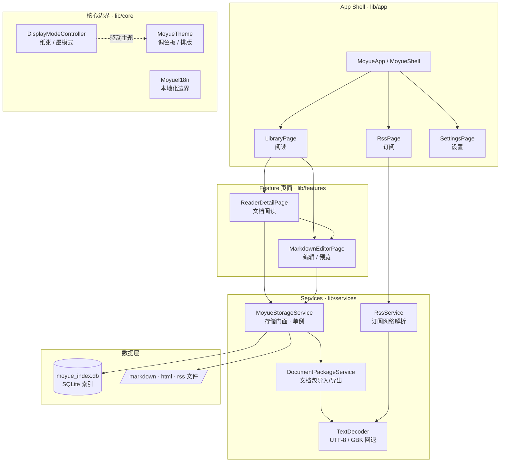
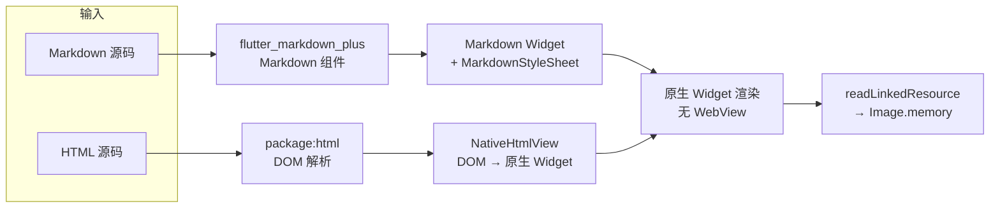
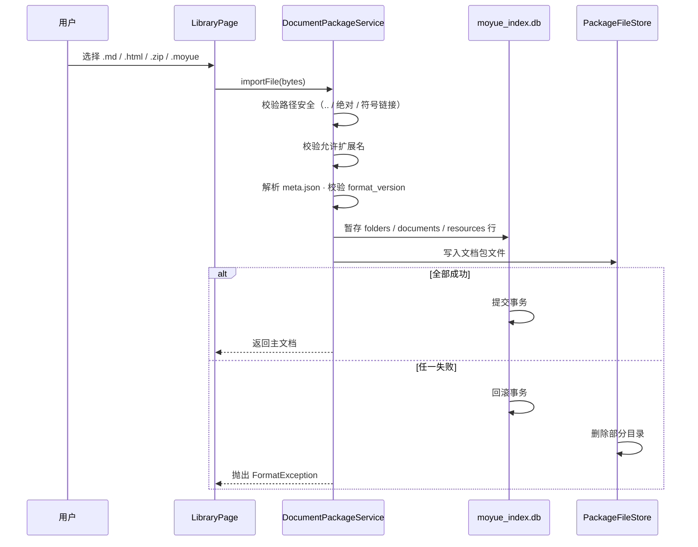
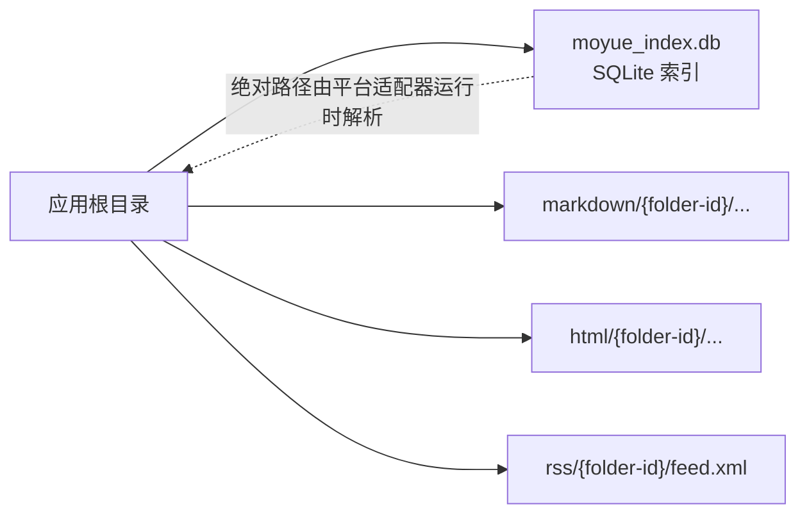
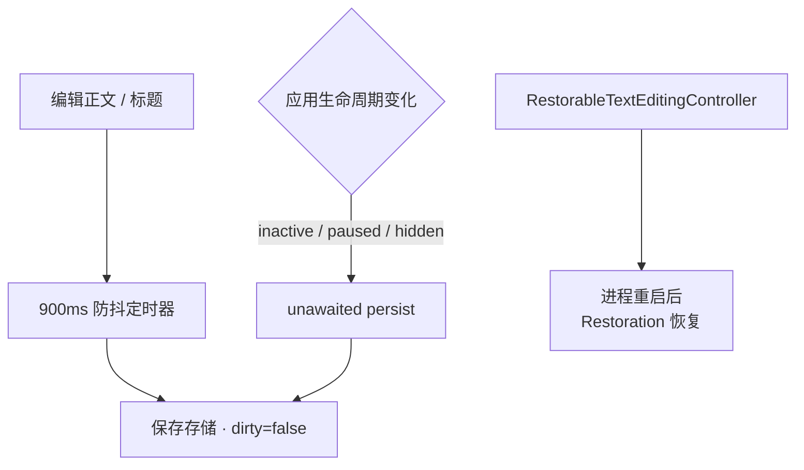

# 墨阅 / Moyue

一款面向**手机阅读场景**的 Markdown、HTML 与 RSS 阅读器。界面使用温和的纸张色、Material 3 排版和克制的 Liquid Glass 交互层（仅用于 Dock、圆形按钮、搜索和工具按钮，正文始终保持在稳定的实体纸张表面上）。

软件原则是**不使用任何 WebView / 浏览器内核**，Markdown 与 HTML 全部映射为原生 Flutter Widget 渲染，以适配移动端与未来的电子墨水屏。

## 当前功能

- 阅读 `.md`、`.markdown`、`.html`、`.htm` 本地文件。
- Markdown 由 `flutter_markdown_plus` 转换为 Flutter Widget；没有 WebView 依赖。
- HTML 由 `package:html` 解析 DOM，再映射为 Flutter 文本、列表、引用和代码区块；没有 WebView 依赖。
- Markdown 编辑、快捷格式工具和原生实时预览。
- 自定义 `.moyue` 文档包（ZIP + `meta.json`）导入 / 导出。
- RSS 1.0 / 2.0 / Atom 订阅、刷新、搜索与外部浏览器打开原文。
- 纸张模式与墨模式，以及对比度和减少动态效果偏好。

## 架构总览



## 渲染管线（无 WebView）

Markdown 与 HTML 各自走原生 Widget 路径，最终都渲染为 Flutter 组件；图片等资源通过 `readLinkedResource` 按文档所在目录解析相对链接后以字节流渲染。



## 文档导入事务（.moyue / .zip）

导入是**事务性**的：先校验路径安全与允许的扩展名，再解析 `meta.json` 并校验 `format_version`，随后暂存 SQLite 行并写文件，全部成功后提交；任一失败则回滚数据库行并删除部分写入的目录。



## 存储映射（SQLite 只存相对路径）



## 编辑器：自动保存与恢复

编辑内容约 900ms 防抖后自动保存；应用进入后台（inactive / paused / hidden）时主动持久化；标题、正文与脏标记均通过 `RestorableTextEditingController` / `RestorationMixin` 支持进程重启后的状态恢复。



## 结构说明

- `lib/core/display/display_preferences.dart` 定义墨模式边界。后续接入电子墨水屏刷新策略时，可替换 `DisplayModeController` 的实现而无需修改业务页面。
- `lib/features/reader/` 包含原生 Markdown/HTML 阅读界面（`NativeHtmlView`）。
- `lib/features/editor/` 包含编辑器、快捷格式与实时预览。
- `lib/features/rss/` 和 `lib/services/rss_service.dart` 包含订阅界面与真实网络解析。
- `lib/services/document_package_service.dart` 实现 `.moyue` / `.zip` 文档包的导入、导出与资源解析。
- `docs/moyue-format-v1.md` 描述 `.moyue` 文档包格式规范 v1。
- `liquid_glass_widgets` 仅用于 Dock、圆形按钮、搜索和工具按钮，正文保持稳定的实体纸张表面。

## 验证

```sh
flutter pub get
flutter analyze
flutter test
flutter build web
```

- 测试位于 `test/`，覆盖文本编码回退、RSS 解析、文档包校验、HTML 渲染与 widget。
- 新增服务 / 解码 / 格式逻辑时请补充对应测试。
