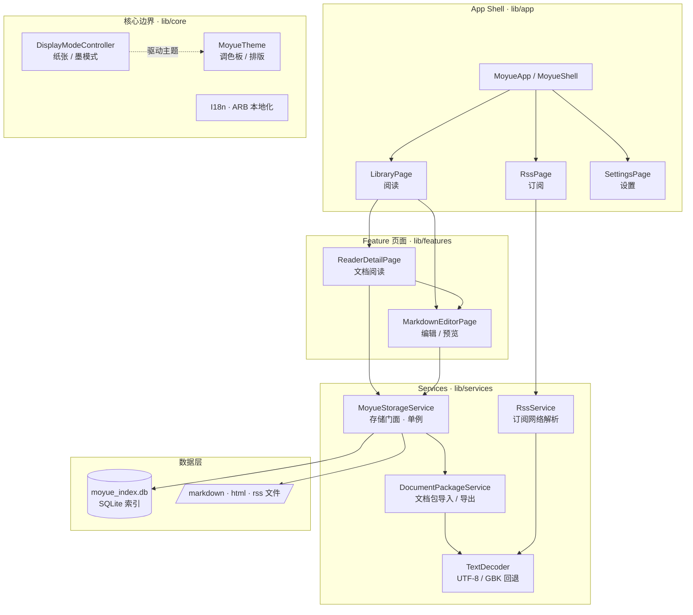
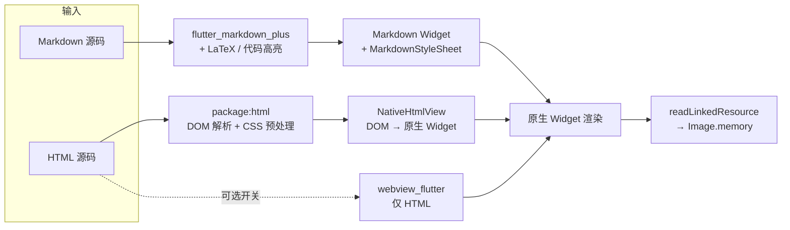

# 墨阅 / Moyue


一款面向**手机阅读场景**的 Markdown、HTML 与 RSS 阅读器。

墨阅不把网页塞进浏览器内核，而是把 Markdown 与 HTML **完整映射为原生 Flutter Widget**：排版可控、滚动顺滑、内存可控，也为将来的电子墨水屏留出空间。界面基调是温和的纸张色、Material 3 排版，以及克制的 Liquid Glass 交互层（只用于底部 Dock、圆形按钮、搜索与工具按钮；正文始终停留在稳定的实体纸张表面上）。

---

## 目录

- [功能亮点](#功能亮点)
- [下载与安装](#下载与安装)
- [快速上手](#快速上手)
- [支持的文件格式](#支持的文件格式)
- [功能详解](#功能详解)
- [.moyue 文档包格式](#moyue-文档包格式)
- [渲染架构](#渲染架构)
- [项目结构](#项目结构)
- [构建与开发](#构建与开发)
- [测试](#测试)
- [平台支持情况](#平台支持情况)
- [权限与隐私](#权限与隐私)
- [已知限制](#已知限制)
- [许可](#许可)

---

## 功能亮点

**原生渲染，默认不加载浏览器内核**

- Markdown 走 `flutter_markdown_plus`，HTML 走 `package:html` DOM 解析 + 原生 Widget 映射，全程不创建 WebView。
- 内置 **LaTeX 数学公式**（`flutter_math_fork` 纯 Flutter 渲染，解析结果带 LRU 缓存）；代码块支持 **22 套高亮主题**、全语言语法。
- 表格、引用、图片、脚注式链接、锚点跳转均由原生控件补齐；CSS 会先做级联与响应式展开，Grid 布局同样原生化。
- 若遇到必须依赖脚本的复杂网页，可在设置中单独为 HTML 打开「网页阅读器」（WebView）开关；Markdown 永远是原生渲染。

**阅读体验**

- 目录（TOC）跳转、字号调节（0.8×–1.4×）、**阅读进度记忆**（按文档隔离，同排版像素级恢复、异排版按比例恢复）。
- 分段渲染（性能优先，默认）与全文渲染（可跨段全选复制）两种模式。
- 图片点击开灯箱、缺失资源占位、链接交外部浏览器打开、正文可选中复制。

**墨模式（电子纸友好）**

- 开启后接管配色、纸纹、字体、动效与玻璃质量：强制减少动效、关闭预见性返回、正文叠加纸纤维纹理、图片降为 ≤16 级灰阶、玻璃质感降级为 standard。
- 切换需要重启应用（偏好只落盘，不做运行时热切换，避免资源争抢导致卡死）。

**文档库**

- 多层文件夹、多选、搜索、长按拖拽移动、递归删除子目录。
- 导入：文件选择器、系统「用其他应用打开」、系统「分享到墨阅」。
- 导出：文档可分享为原文件 / 纯文本 / **整页长图 PNG**；文件夹导出为 `.moyue` 文档包。

**Markdown 编辑器**

- 900 ms 防抖自动保存，进程重启可恢复草稿；标题与正文各自独立的撤销 / 重做。
- 快捷格式栏（标题、粗体、斜体、引用、列表、链接、行内代码、插入图片）吸附在输入法上方，不随 IME 动画抖动。
- 实时预览、按 Unicode 字符数统计字数、保存状态提示。

**RSS 订阅**

- RSS 2.0 与 Atom 解析，HTTPS 订阅源、下拉全量刷新、关键词搜索、离线 XML 缓存、原文交给外部浏览器打开。

**个性化**

- Material You 动态取色（Android 12+，默认关闭）或 5 组预设色 + HSV 调色轮自定义。
- 浅色 / 深色 / 跟随系统；6 套 Markdown 阅读配色；软件字号 85%–140%；系统无衬线 / Claude 风格衬线 / 圆体。
- 语言：跟随系统 / 简体中文 / English。
- 减少动态效果、Android 预见性返回、清除缓存、清空应用数据。

---

## 下载与安装

发布包在 GitHub Releases 上：

> <https://github.com/ouyangyanhuo/moyue/releases>

每个版本提供 4 个 APK，按需选择：

| 文件 | 适用设备 |
| --- | --- |
| `moyue-application-<版本>-arm64-v8a.apk` | 绝大多数现代 Android 手机（**推荐**） |
| `moyue-application-<版本>-armeabi-v7a.apk` | 较旧的 32 位 ARM 设备 |
| `moyue-application-<版本>-x86_64.apk` | x86_64 设备与模拟器 |
| `moyue-application-<版本>-universal.apk` | 通用包，含全部 ABI，兼容性最好但体积最大 |

安装包附带 `SHA256SUMS.txt`，下载后建议校验：

```sh
# Linux / macOS
sha256sum -c SHA256SUMS.txt

# Windows（PowerShell）
Get-FileHash moyue-application-1.0.1-arm64-v8a.apk -Algorithm SHA256
```

安装要求：**Android 7.0（API 24）及以上**。APK 未经签名时会退化为 debug 签名，首次安装需允许「未知来源应用」。

---

## 快速上手

1. **导入文档**：底部 Dock 右侧「+」→ 导入，选择 `.md` / `.html` / `.htm` / `.zip` / `.moyue`；也可以直接在文件管理器或微信等应用中「用其他应用打开 / 分享」到墨阅。
2. **开始阅读**：点击文档进入阅读页，右下角调节字号，右上角打开目录。
3. **写点东西**：Dock「+」→ 新建 Markdown，进入编辑器；内容会自动保存，随时切到预览查看排版。
4. **订阅信息源**：切到「订阅」页 → 右下角「+」→ 填入 `https` 开头的 RSS/Atom 地址。
5. **整理书库**：长按文档或文件夹进入多选，拖动即可移动到任意文件夹。

---

## 支持的文件格式

| 扩展名 | 说明 |
| --- | --- |
| `.md` | Markdown，可编辑、可预览 |
| `.html` / `.htm` | HTML，原生 Widget 渲染（或可选 WebView） |
| `.moyue` | 墨阅文档包（ZIP + `meta.json`），可含多篇文档与图片/视频资源 |
| `.zip` | 按 `.moyue` 规则解析的通用压缩包 |

导入时的安全边界：路径中出现的 `..`、绝对路径、盘符与符号链接一律拒绝；包内文件必须落在白名单扩展名内（`.md` `.html` `.css` `.js` 与常见图片/视频）；`meta.json` 缺失或主文档缺失直接判为非法包。外部导入的文本文档上限 8 MB，文档包上限 128 MB。文本解码走 UTF-8（含 BOM）优先、GBK 回退，旧式 ZIP 的中文文件名同样能恢复。

---

## 功能详解

### 文档库（阅读页）

- 根文件夹与子文件夹可无限嵌套；文件夹页内子目录按名称升序、文档按修改时间倒序。
- 多选后可批量分享或删除；长按拖拽会浮出「移动目标托盘」，目标过多时展开为双列面板。
- 文件夹可重命名（仅根文件夹）、可整体导出为 `.moyue`。
- 搜索框支持中英文关键词。

### 阅读页

- Markdown 与 HTML 都会提取 `h1`–`h6` 生成目录；无标题时给出明确提示。
- 阅读进度在滚动停止、进入后台与退出页面时保存，重进时同时恢复上次字号。
- 「全选」会自动从分段渲染切到全文渲染，保证复制完整。
- 只有 Markdown 文档能进入编辑器；HTML 文档为只读阅读。

### 编辑器

- 仅用于 Markdown。标题为空不允许保存；返回键统一走「先落盘再退出」。
- 插入图片会写入文档旁的 `images/` 目录并生成相对链接，退出时自动清理未引用的图片。
- Android 上通过原生键盘事件（API 30+）稳定工具栏位置。

### 订阅页

- 订阅源地址强制 `https`。刷新超时 12 秒，每个源最多取 30 条。
- 原始 feed XML 会缓存到本地，启动时先读缓存再联网。
- 文章列表按源分组，支持按标题 / URL / 摘要搜索。

### 设置页

设置项支持搜索（可用「莫奈」「夜间」「护眼」「预见性返回」等中文别名检索）。分组为：显示、排版、阅读、通用、存储，调试分组仅在调试模式下出现。

**调试模式**：在应用数据目录下放置 `debug/debug.lock`，内容含一行 `debug = true`（忽略大小写与空白），重启或切回前台即可生效；随后设置页出现「帧率实时显示」开关。Android 路径为 `/Android/data/com.moyue.application/files/debug/debug.lock`。删除该文件即退出调试模式。

---

## .moyue 文档包格式

`.moyue` 是一个标准 ZIP 归档（UTF-8 文件名），归档根必须包含 `meta.json`：

```json
{
  "format": "moyue",
  "format_version": 1,
  "display_name": "示例文集",
  "marker": "exported",
  "single": false,
  "primary_document": "docs/intro.md",
  "documents": [
    { "path": "docs/intro.md", "kind": "markdown", "sha256": "…" }
  ],
  "resources": [
    { "path": "images/cover.png", "mime_type": "image/png", "sha256": "…", "size": 1024 }
  ]
}
```

- `single = true` 表示包内只有一份主文档；`single = false` 时递归索引所有 Markdown / HTML，并以 `primary_document` 作为打开入口。
- `sha256` 基于**未压缩**的文件字节；未知字段必须被忽略，保证向前兼容。
- 附件缺失不会导致导入失败，阅读端会显示缺失占位；但主文档缺失属于导入错误。
- 完整规范见 [`docs/moyue-format-v1.md`](docs/moyue-format-v1.md)。

导入是**事务性**的：校验路径与元数据 → 在同一 SQLite 事务中暂存 `folders` / `documents` / `resources` 行 → 写文件 → 全部成功才提交；任一步失败则回滚数据库行并删除已写入的部分目录。

---

## 渲染架构


```mermaid
flowchart TD
    subgraph SHELL[App Shell · lib/app]
        A[MoyueApp / MoyueShell]
        A --> B[LibraryPage<br/>阅读]
        A --> C[RssPage<br/>订阅]
        A --> D[SettingsPage<br/>设置]
    end

    subgraph FEAT[Feature 页面 · lib/features]
        B --> E[ReaderDetailPage<br/>文档阅读]
        B --> F[MarkdownEditorPage<br/>编辑 / 预览]
        E --> F
    end

    subgraph CORE[核心边界 · lib/core]
        G[DisplayModeController<br/>纸张 / 墨模式]
        H[MoyueTheme<br/>调色板 / 排版]
        I[I18n · ARB 本地化]
    end

    subgraph SVC[Services · lib/services]
        J[MoyueStorageService<br/>存储门面 · 单例]
        K[DocumentPackageService<br/>文档包导入 / 导出]
        L[RssService<br/>订阅网络解析]
        M[TextDecoder<br/>UTF-8 / GBK 回退]
    end

    subgraph DATA[数据层]
        N[(moyue_index.db<br/>SQLite 索引)]
        O[/markdown · html · rss 文件/]
    end

    E --> J
    F --> J
    C --> L
    J --> K
    J --> N
    J --> O
    K --> M
    L --> M
    G -.驱动主题.-> H
```

两条渲染路径，最终都收敛为 Flutter Widget：


```mermaid
flowchart LR
    subgraph IN[输入]
        MD1[Markdown 源码]
        HTML1[HTML 源码]
    end

    MD1 --> MFP[flutter_markdown_plus<br/>+ LaTeX / 代码高亮]
    HTML1 --> HP[package:html<br/>DOM 解析 + CSS 预处理]

    MFP --> W1[Markdown Widget<br/>+ MarkdownStyleSheet]
    HP --> W2[NativeHtmlView<br/>DOM → 原生 Widget]
    HTML1 -.可选开关.-> WV[webview_flutter<br/>仅 HTML]

    W1 --> RW[原生 Widget 渲染]
    W2 --> RW
    WV --> RW

    RW --> RES[readLinkedResource<br/>→ Image.memory]
```

---

## 项目结构

```
lib/
  main.dart                     入口
  app/moyue_app.dart            MaterialApp + 三栏 Shell（阅读 / 订阅 / 设置），玻璃 Dock
  core/
    theme/                      调色板、纸张色、排版、buildMoyueTheme
    display/                    DisplayModeController、玻璃样式、Markdown / 代码主题注册表
    files/                      导入扩展名与大小策略
    i18n/                       本地化稳定边界
  features/
    reader/                     文档库、阅读页、NativeHtmlView、WebView 回退
    editor/                     Markdown 编辑器与键盘控制器
    rss/                        订阅页
    settings/                   设置页
    debug/                      FPS 浮层
  models/                       ReadingDocument / LibraryFolder / FeedSource / FeedArticle
  services/                     存储门面、文档包、RSS、文本解码、阅读进度、分享、调试
    storage/                    存储后端抽象（IO / 内存 stub）
    database/                   SQLite 索引
  widgets/                      共享组件（纸面背景、玻璃按钮、图片灯箱等）
  l10n/                         ARB 与 gen-l10n 产物
docs/moyue-format-v1.md         .moyue 文档包格式规范 v1
test/                           widget / service / 性能测试
.github/workflows/build_apk.yml Android Release APK CI
```

---

## 构建与开发

### 环境

- Flutter **3.47 stable**（Dart 3.13）或更高
- Android：JDK 17、Android SDK（compileSdk / targetSdk 36，minSdk 24）
- 其他平台目录（iOS / Web / Windows / macOS / Linux）已就位，但**主目标平台是 Android**

### 常用命令

```sh
flutter pub get
flutter analyze          # 静态分析（flutter_lints）
flutter test             # widget / service / 性能测试
flutter build apk --release --split-per-abi
flutter build web        # Web 构建校验
```

### 签名

`android/app/build.gradle.kts` 从环境变量读取签名配置：

```
KEYSTORE_PATH  KEYSTORE_PASSWORD  KEY_ALIAS  KEY_PASSWORD
```

未配置时 `release` 自动回退 debug 签名，方便本地验证。

### CI

`.github/workflows/build_apk.yml` 在推送 `v*` tag 或手动触发时执行：

1. 解析版本号（tag / 手动输入 / `pubspec.yaml`）；
2. 用 `--dart-define=MOYUE_INTERNAL_VERSION` 绑定关于页内部版本号，并跑 `test/app_version_service_test.dart` 校验；
3. 构建 `--split-per-abi`（armeabi-v7a / arm64-v8a / x86_64）与 universal 包；
4. 产出 `SHA256SUMS.txt`，自动生成 release notes 并发布 GitHub Release。

版本号由 `pubspec.yaml` 的 `version: x.y.z+build` 驱动（当前 `1.0.1+3`）。

---

## 测试

`test/` 下 29 个测试文件，覆盖：

- **渲染**：Markdown LaTeX 语法与缓存、原生 HTML 映射、WebView 切换、行内代码、图片解码与灯箱。
- **存储**：索引 / 正文分离加载、v3→v4 索引升级、图片清理、子目录移动与导出、ZIP 导入。
- **文档包**：编解码、不安全路径拒绝、解压大小与文件数限制、CRC 损坏、格式校验。
- **偏好与显示**：墨模式覆盖规则、WebView 与渲染模式持久化、主题注册表、Monet 默认值。
- **编辑器**：撤销 / 重做、格式按钮二次点击撤销、键盘工具栏定位、图片插入失败提示。
- **其他**：RSS 解析与 GBK 中文 feed、文本编码回退、阅读进度恢复、设置页中英文界面、调试锁文件、关于页版本。

```sh
flutter test
```

---

## 平台支持情况

| 平台 | 状态 |
| --- | --- |
| **Android** | ✅ 完整支持（外部文件桥、Monet 取色、应用重启、缓存清理、原生键盘事件） |
| iOS / Windows / macOS / Linux | ⚠️ 工程文件齐全、可构建，但**未做桌面窗口适配**，iOS 也缺少文档类型声明，属实验性 |
| Web | ⚠️ 可构建；文件存储走内存后端，**数据不会持久化** |

---

## 权限与隐私

- Android 仅声明 **一项权限**：`android.permission.INTERNET`，只用于抓取 RSS / Atom 订阅源。
- 不申请存储权限：导入通过系统文件选择器（SAF）与 ContentResolver 完成，文档存放在应用私有目录。
- 不内置统计、不上传数据；所有文档、订阅与偏好均保存在本机。
- 清除缓存会清空 `cacheDir` / `codeCacheDir` / `externalCacheDir`；清空应用数据会调用系统接口终止进程并删除全部私有数据，操作前有红色危险确认。

---

## 已知限制

- 订阅源只解析 **RSS 2.0 与 Atom**；RSS 1.0（RDF）未做专门分支。
- 订阅文章没有逐篇的已读 / 未读状态（仅有未读计数），也不支持 OPML 导入导出。
- 导入不支持 `.txt` 与 `.markdown`（磁盘上已存在的 `.markdown` 仍会被列出）。
- **文档重命名**暂未提供（文件夹可重命名）。
- 文档列表排序规则固定：文档按修改时间倒序、子目录按名称升序，暂无排序控件。
- 无朗读（TTS）功能。
- 墨模式切换、软件字号变更都需要重启应用生效。
- iOS 端无法从系统「文件」App 或分享菜单打开文档。
- 阅读器不做分页，长文档为连续滚动（墨模式同样如此）。

---

## 许可

本项目当前未附带开源许可证文件，默认保留所有权利。转载、二次分发或商用前请先与作者联系。

作者：**Magneto** · 仓库：<https://github.com/ouyangyanhuo/moyue>
